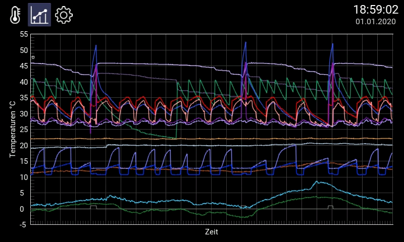

# Data Logger
Measure, display and log temperatures with Raspberry PI.

This is a simply hobby project for logging temperatures in my heating system. Feel free to adjust and use it in your own projects.

## Features

### Current Temperatures
Show the current readings:

### Temperature Graphs
Show how temperatures developed over the last 24 hours:

### MQTT Client
Publish all temperature readings to a MQTT broker. This allows to track and show them in common MQTT apps.
The MQTT messages contain JSON with timestamp and value:

    {"timestamp": "2018-03-10T16:53:11.335794", "unit": "\u00b0C", "value": 24.8}

### CSV Logging
The temperature readings are written to CSV files and held for 32 days. This also allows to immediately re-fill the graphs view after restart.

## Hardware

- Raspberry PI 3
- Official Raspberry PI 7" touch display, 800x480 (expensive, but well supported in Raspbian, multi-touch)
- Official Raspberry power supply 5.1V/2.5A with additional 330uF capacitor for stabilization (Raspi is quite picky here...)
- Heat sink on Raspberry CPU (... to avoid the random crashes that may occur otherwise)
- DS 18B20 temperature sensors (1-Wire bus allows many sensors at the same GPIO port, well supported in Raspbian)
- TSIC 306 temperature sensors (high accurracy, expensive, but already installed from a previous project)

## Platform

- OS: Raspbian Jessie
- Language: Python 3.6 (coming from Java I begin to really like Python, however, the code is still at Python beginner's level)
- UI toolkit: Kivy (nice and simple UIs with multi-touch support, some quirks)
- Charts: Kivy Garden Graphs (fast drawing)
- GPIO access: PIGPIO (IO with precise timing)

## Installation / Configuration

TO BE DONE!
- Set-up Python modules
- Set-up W1 bus (Kernel modules)
- Patch Kivy logging (do not set root logger which clashed with standard Python logging)
- Use most current Kivy development version to allow graphs within Carousel widget
- Use Raspi in console mode since Kivy input events also go to the underlying X UI and trigger things you certainly won't want
- Change permissions to allow display backlight control
- Patch pigpiod (stack smashing issue)
- How to find out the DS18B20 sensor IDs
- How to configure the data logger by changing `signalsourcesconfig.py`
- Nore topics? Find out by clean install with pure Raspbian
