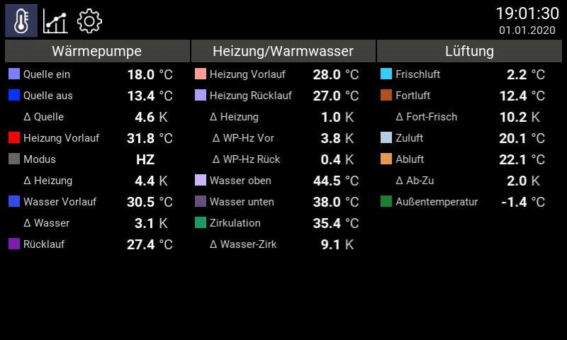

# Data Logger
Measure, display and log temperatures with Raspberry PI.

This is a simple hobby project for logging temperatures of my heat pump and heating system. 
Feel free to use it in your own projects (Apache License Version 2.0).

It contains some icons from [Flaticon](https://www.flaticon.com/), license [Creative Commons BY 3.0](http://creativecommons.org/licenses/by/3.0/), see [CREDITS](CREDITS.html) for details.

## Features

### Current Temperatures
Show the current readings:

### Temperature Graphs
Show how temperatures developed over the last 24 hours:

### MQTT Client
Publish all temperature readings to a MQTT broker. This allows to track and show them in common MQTT apps.
The MQTT messages contain JSON with timestamp and value:

    { "status": "ok", "timestamp": "2020-11-13T17:08:57.753064", "value": 9.697, "unit": "°C", "formatted": "9.7" }

### CSV Logging
The temperature readings are written to CSV files and held for 32 days. This also allows to immediately re-fill the graphs view after restart.

## Hardware

- Raspberry PI 3
- Official Raspberry PI 7" touch display, 800x480 (expensive, but well supported in Raspbian, multi-touch)
- Official Raspberry power supply 5.1V/2.5A with additional 330uF capacitor for stabilization (Raspi is quite picky here...)
- Heat sink on Raspberry CPU (... to avoid the random crashes that may occur otherwise)
- DS 18B20 temperature sensors (1-Wire bus allows many sensors at the same GPIO port, well supported in Raspbian)
- TSIC 306 temperature sensors (high accurracy, expensive, but already installed from a previous project)

## Platform

- OS: Raspbian Jessie
- Language: Python 3.6 (coming from Java I begin to really like Python, however, the code is still at Python beginners' level)
- UI toolkit: Kivy (nice and simple UIs with multi-touch support, some quirks)
- Charts: Kivy Garden Graph (fast drawing)
- TSIC temperature sensors: tsic (sensor reading based on pigpio)
- GPIO access: pigpio (IO with precise timing)

## Installation / Configuration

TODO - topics to cover:
- Set-up Python modules (`pip3`, `garden`, don't forget `sudo`)
- Set-up W1 bus (kernel modules)
- Set-up touch and display within Kivy
- Patch Kivy logging (do not set root logger which clashes with standard Python logging and is buggy)
- Use most current Kivy development version to support garden graph within Carousel widget
- Use Raspi in console mode since Kivy input events also go to the underlying X-UI and trigger things you certainly don't want
- Change permissions `chmod 666 '/sys/class/backlight/rpi_backlight/bl_power'` in `/etc/rc.local` to allow display backlight control (screen saver)
- Patch pigpiod (stack smashing issue)
- Log files path `logs/`
- CSV files path `csv/`
- Discover the DS18B20 sensor IDs in `/sys/bus/w1/devices/` 
- Configure data logger by changing `signalsourcesconfig.py`
- Start with `python3 main.py`, auto-start in `/etc/rc.local` as `su - pi -c 'cd data-logger; python3 main.py &'`
- Prefer WLAN to LAN to avoid power surges depending on sensor cabling
- More topics? Find out by clean install with pure Raspbian
